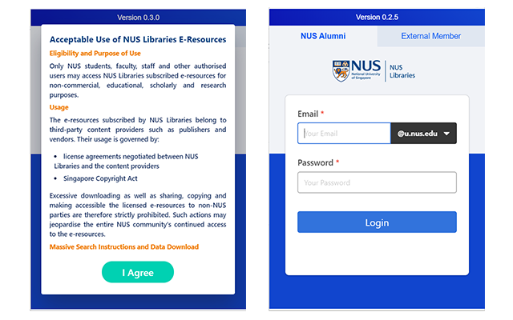

# nusl-extension
<p align="center"><b>A <i><a href="https://developer.chrome.com/extensions/getstarted" target="_blank">Chrome Browser Extension</a></i> for Onsite E-Resource Access in NUS</b></p>
<p align="center"></p>
<p>This browser extension is made for NUS alumni and NUS Libraries members to access electronic resources onsite within NUS Libraries.</p>

# Getting Started
To install dependencies and compile the app, run the following command:
```
npm install
npm run build
```
